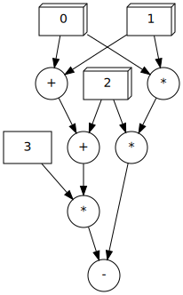

# Expr2Graph

A Converter from Expression to Graph(dot)



## Compile

1. build using `Stack`

   ```bash
   stack build
   ```

2. run with `Stack`

   ```bash
   stack run
   ```

3. test with `Stack`

   ```bash
   stack test
   ```

## Usage

An expression in each line, whose syntax is as below.

### Syntax

We use syntax based on (Actually *the same as* by now) this [CodeWars Kata](https://www.codewars.com/kata/tiny-three-pass-compiler) which meas we Parse an `function` defined as below.

```bnf
function   ::= '[' arg-list ']' expression

arg-list   ::= /* nothing */
                 | variable arg-list

expression ::= term
                 | expression '+' term
                 | expression '-' term

term       ::= factor
                 | term '*' factor
                 | term '/' factor

factor     ::= number
                 | variable
                 | '(' expression ')'
```

For example these functions below are OK

```
[ a b ] a*a + b*b
[ first second ] (first + second) / 2
[a b c]a*a+b*b+(a+b)*(a+c)/2
```

### Output

NOTICE: This program **DOES NOT** generate any image format such as `svg` or `jpeg` but the content of an `dot` file, which can convert to an image file using [Graphviz](https://graphviz.org/).

So you can use command like this to generate an image

```bash
echo "[a b] (a+b)/2" | stack run | dot -Tsvg > graph.svg
```

BTW this result is as below


### Elements

| Symbol | Meaning                                        |
| ------ | ---------------------------------------------- |
| Circle | Operator such as `+`,`-`,`*`,`/`               |
| Box    | An Immediately number(only `Integers` for now) |
| Box3D  | The Index(beginning with `0`) of an Argument   |

## Known Bugs

* When combining sub-trees, there are still some duplicate errors in graph (`[a b] a*a + a*b + a*b + b*b` as below)

  

## TODO-List

* More operator such as `^`
* Some new feature like `let...in...`
* Named function
* Recursion support